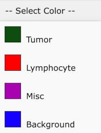
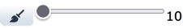
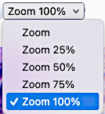

# Image Annotation Toolbar

## Table of Contents
- [Color/Cancer-Type Dropdown](#color-cancer-type-dropdown)
- [Free-Drawing Brush](#free-drawing-brush)
- [Rectangle Brush](#rectangle-brush)
- [Ellipse Brush](#ellipse-brush)
- [Polygon Brush](#polygon-brush)
- [Hollow Brush + Size Slider](#hollow-brush--size-slider)
- [Grid Tool](#grid-tool)
- [Edit Polygon](#edit-polygon)
- [Edit Label](#edit-label)
- [Get Area and Circumference](#get-area-and-circumference)
- [Ruler](#ruler)
- [Download PNG Snapshot](#download-png-snapshot)
- [Crosshairs Toggle](#crosshairs-toggle)
- [Save](#save)
- [List Annotation Sets](#list-annotation-sets)
- [Lock Rotation](#lock-rotation)
- [Re-orient View](#re-orient-view)
- [Zoom Dropdown](#zoom-dropdown)
- [Brightness and Contrast Sliders](#brightness-and-contrast-sliders)
- [Reset Brightness and Contrast Button](#reset-brightness-and-contrast-button)
- [Image Navigation](#image-navigation)

## Color/Cancer Type Dropdown
Allows you to select the color / cancer-type for your brush. Choose the desired color from the dropdown before drawing or editing annotations.

## Free-Drawing Brush
A flexible brush for free-hand drawing. Simply click and hold the mouse button to start drawing, then release to finish.  For touch screens, touch and draw then lift the pen.

## Rectangle Brush
Creates a rectangle by clicking and dragging. Release the mouse button (or lift your drawing pen) to complete the rectangle.

## Ellipse Brush
Draws an ellipse by clicking and dragging. Adjust the size and shape of the ellipse by dragging before releasing the mouse button or lifting the drawing pen.

## Polygon Brush
Click to create points and define the shape of the polygon. Double-click (or double-tap) to complete the polygon.

## Hollow Brush + Size Slider
Draws a hollow shape. Use the size slider to adjust the thickness of the hollow shape.

## Grid Tool
Draws a grid on the screen, allowing you to color individual squares to indicate specific cancer types.  Tap or click to fill in a square.  Shift-click to remove color or double-tap to go into "removal" mode.

## Edit Polygon
Provides edit handles on polygons, allowing you to reshape or delete them.  Click inside the polygon to select it for editing.

## Edit Label
View or edit the label associated with an annotation. Useful for updating cancer types or other metadata.  Click inside the polygon to select it.

## Get Area and Circumference
Calculates and displays the area and circumference of selected shapes or polygons.  Click inside the polygon to select it.

## Ruler
Measures distances in pixels on the image. Click (or touch) to start measuring and drag to the endpoint to see the pixel distance.

## Download PNG Snapshot
Downloads a snapshot of the current view as a PNG file, preserving your annotations.

## Crosshairs Toggle
Toggles crosshairs to help you find the center of the current view.

## Save
Saves the current annotations, ensuring all changes are preserved for future use.

## List Annotation Sets
Displays a list of all annotation sets, allowing you to update labels and toggle visibility by checking or unchecking boxes.

## Lock Rotation
Locks the rotation of the image, preventing it from rotating while zooming.

## Re-orient View
Resets the view to its original orientation, as it was when the session began.

## Zoom Dropdown
Allows you to zoom in or out of the image by selecting a percentage from the dropdown. Use 100% for the best view.

## Brightness and Contrast Sliders
Adjust the brightness and contrast of the image to enhance visibility of details.

## Reset Brightness and Contrast Button
Resets the brightness and contrast settings to their default values.

## Image Navigation

MOVE mouse &amp; press LEFT: rotate, SCROLL: zoom, RIGHT: pan

 
